# Java Reverse Engineering Learning Roadmap

> A systems-thinking approach to mastering Java by decomposing the platform into progressively smaller components and understanding each one in isolation before reassembling the complete system.

---

## Recommended Reading Order

1. [Phase 1 — Foundation](#phase-1--foundation)
2. [Phase 2 — Java Language](#phase-2--java-language)
3. [Phase 3 — Compiler](#phase-3--compiler)
4. [Phase 4 — Class File](#phase-4--class-file)
5. [Phase 5 — Bytecode](#phase-5--bytecode)
6. [Phase 6 — JVM](#phase-6--jvm)
7. [Phase 7 — Runtime Libraries](#phase-7--runtime-libraries)
8. [Phase 8 — Concurrency](#phase-8--concurrency)
9. [Phase 9 — IO](#phase-9--io)
10. [Phase 10 — Networking](#phase-10--networking)
11. [Phase 11 — Reflection](#phase-11--reflection)
12. [Phase 12 — Diagnostics](#phase-12--diagnostics)
13. [Phase 13 — OpenJDK Source Code](#phase-13--openjdk-source-code)
14. [Phase 14 — Reassemble the Entire System](#phase-14--reassemble-the-entire-system)
15. [Knowledge Cards](#knowledge-cards)

---

## Table of Contents

- [Learning Rules](#learning-rules)
- [The Java Reverse Engineering Tree](#the-java-reverse-engineering-tree)
- [Phase 1 — Foundation](#phase-1--foundation)
- [Phase 2 — Java Language](#phase-2--java-language)
- [Phase 3 — Compiler](#phase-3--compiler)
- [Phase 4 — Class File](#phase-4--class-file)
- [Phase 5 — Bytecode](#phase-5--bytecode)
- [Phase 6 — JVM](#phase-6--jvm)
  - [Assembly 6.1 — Class Loading](#assembly-61--class-loading)
  - [Assembly 6.2 — Runtime Memory](#assembly-62--runtime-memory)
  - [Assembly 6.3 — Objects](#assembly-63--objects)
  - [Assembly 6.4 — Execution Engine](#assembly-64--execution-engine)
  - [Assembly 6.5 — Garbage Collection](#assembly-65--garbage-collection)
- [Phase 7 — Runtime Libraries](#phase-7--runtime-libraries)
  - [Collections](#collections)
- [Phase 8 — Concurrency](#phase-8--concurrency)
- [Phase 9 — IO](#phase-9--io)
- [Phase 10 — Networking](#phase-10--networking)
- [Phase 11 — Reflection](#phase-11--reflection)
- [Phase 12 — Diagnostics](#phase-12--diagnostics)
- [Phase 13 — OpenJDK Source Code](#phase-13--openjdk-source-code)
- [Phase 14 — Reassemble the Entire System](#phase-14--reassemble-the-entire-system)
- [Knowledge Cards](#knowledge-cards)

---

Excellent. I think we now have enough information to build something that matches how **you** think, rather than how Java books are organized.

I'm going to make one important design decision.

> **We will not learn “Java”. We will reverse engineer the Java Platform.**

Imagine OpenJDK engineers disassembled Java into thousands of pieces and laid them on a table. We are going to pick up one piece at a time, understand it completely, and then assemble the entire system.

---

## Learning Rules

Every concept you study will answer the same questions.

| Question | Purpose |
| --- | --- |
| Why does this exist? | Understand motivation. |
| What problem does it solve? | Understand the problem being addressed. |
| What are its parts? | Identify the internal structure. |
| How do the parts work together? | Understand interactions. |
| What depends on it? | Identify consumers. |
| What does it depend on? | Identify prerequisites. |
| Can I build a simplified version? | Reinforce understanding through implementation. |

This becomes your standard operating procedure.

> **Goal**
>
> Understand why each subsystem exists before learning how it works.

---

## The Java Reverse Engineering Tree

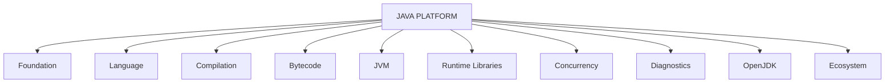

Every topic belongs somewhere here.

---

## Phase 1 — Foundation

Don't write Java yet.

Just understand what Java actually is.

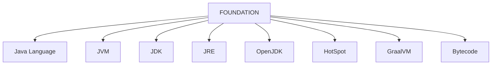

### Questions

- What is Java?
  
  Java is best understood as a **software platform**, not just a programming language. The Java language is only one part of that platform—it lets developers express application logic using a well-defined syntax and set of rules. That source code is then compiled by the Java compiler (`javac`) into **bytecode**, an intermediate, platform-independent instruction set. 
  
  The **Java Virtual Machine (JVM)** executes this bytecode, manages memory, performs garbage collection, optimizes execution through Just-In-Time (JIT) compilation, and interacts with the underlying operating system. Alongside the JVM, Java provides a rich **standard library** (collections, networking, I/O, concurrency, etc.) and development tools bundled in the **Java Development Kit (JDK)**. 
  
  In other words, when people say "Java," they are usually referring to an ecosystem composed of the **language, compiler, bytecode, JVM, runtime libraries, and developer tools**, all working together to provide a portable, secure, and high-performance application platform.

- What isn't Java?

  A common misconception is that Java is not just a programming language, nor is it the JVM, the JDK, or the operating system. The Java language is only the syntax and rules developers use to write programs.

  The Java Virtual Machine (JVM) is the runtime that executes compiled Java bytecode, while the Java Development Kit (JDK) is a toolkit that includes the compiler (javac), the JVM, standard libraries, and development utilities.

  Java is also not machine code that runs directly on a CPU, nor does it communicate directly with hardware or the operating system; the JVM performs those interactions on behalf of Java applications.

  Finally, Java is not synonymous with frameworks such as Spring or Jakarta EE—these are independent technologies built on top of the Java platform, not part of Java itself.
- Why does the JVM exist?
- Why compile to bytecode instead of machine code?
- Why are there multiple JVM implementations?
- Why does the JDK include the JRE?
- What is OpenJDK versus Oracle JDK?

### Goal

You should be able to explain what happens after someone types:

```text
java Main
```

without discussing code.

### Knowledge Card — Foundation

| Item | Details |
| --- | --- |
| Parent | Java Platform |
| Purpose |  |
| Components | Java Language; JVM; JDK; JRE; OpenJDK; HotSpot; GraalVM; Bytecode |
| Dependencies |  |
| Consumers |  |
| Lifecycle |  |
| Algorithms |  |
| Common Mistakes |  |
| Mini Project |  |
| OpenJDK Source |  |

### Completion Checklist

- [ ] I understand why this subsystem exists
- [ ] I understand every component
- [ ] I understand interactions
- [ ] I know dependencies
- [ ] I can explain it without notes
- [ ] I built the suggested mini project

---

## Phase 2 — Java Language

Now learn only the language.

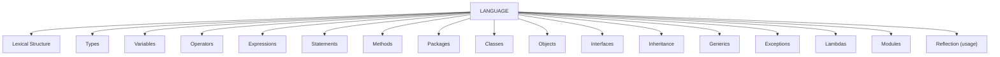

### Example Decomposition — Classes

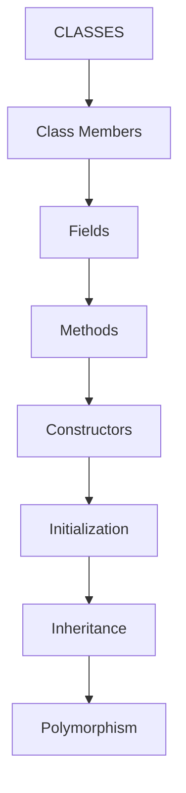


### Example Decomposition — Classes


> **Note**
>
> Don't move to Interfaces until Classes are completely understood.

### Knowledge Card — Java Language

| Item | Details |
| --- | --- |
| Parent | Java Platform |
| Purpose |  |
| Components | Lexical Structure; Types; Variables; Operators; Expressions; Statements; Methods; Packages; Classes; Objects; Interfaces; Inheritance; Generics; Exceptions; Lambdas; Modules; Reflection (usage) |
| Dependencies | [Foundation](#phase-1--foundation) |
| Consumers | [Compiler](#phase-3--compiler) |
| Lifecycle |  |
| Algorithms |  |
| Common Mistakes | Moving to Interfaces before Classes are completely understood. |
| Mini Project |  |
| OpenJDK Source |  |

See also:

- [Compiler](#phase-3--compiler)
- [Reflection](#phase-11--reflection)

### Completion Checklist

- [ ] I understand why this subsystem exists
- [ ] I understand every component
- [ ] I understand interactions
- [ ] I know dependencies
- [ ] I can explain it without notes
- [ ] I built the suggested mini project

---

## Phase 3 — Compiler

Forget Java execution.

Study only the compiler.

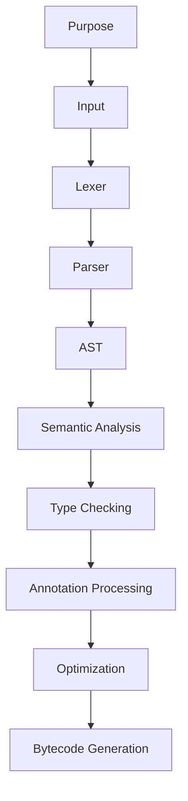

### Mini Project — Build a Tiny Expression Compiler

**Goal**

Build a tiny expression compiler.

**Example**

```text
5+8*3
```

Convert it into a tree.

You now understand parsing.

**Expected Learning**

Understand parsing.

**Difficulty**

**Estimated Time**

### Knowledge Card — Compiler

| Item | Details |
| --- | --- |
| Parent | Compilation |
| Purpose |  |
| Components | Purpose; Input; Lexer; Parser; AST; Semantic Analysis; Type Checking; Annotation Processing; Optimization; Bytecode Generation |
| Dependencies | [Java Language](#phase-2--java-language) |
| Consumers | [Class File](#phase-4--class-file); [Bytecode](#phase-5--bytecode) |
| Lifecycle |  |
| Algorithms | Parsing |
| Common Mistakes |  |
| Mini Project | Build a tiny expression compiler. |
| OpenJDK Source |  |

See also:

- [Java Language](#phase-2--java-language)
- [Class File](#phase-4--class-file)
- [Bytecode](#phase-5--bytecode)

### Completion Checklist

- [ ] I understand why this subsystem exists
- [ ] I understand every component
- [ ] I understand interactions
- [ ] I know dependencies
- [ ] I can explain it without notes
- [ ] I built the suggested mini project

---

## Phase 4 — Class File

Java source no longer exists.

Only study:

```text
Main.class
```

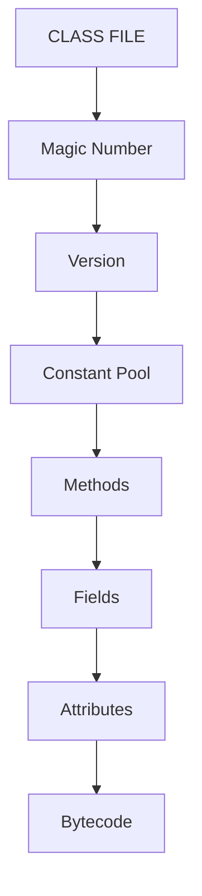

### Mini Project — Inspect Every Class

**Goal**

Open every class using:

```text
javap -v
```

> **Tip**
>
> Never guess. Verify.

**Expected Learning**

**Difficulty**

**Estimated Time**

### Knowledge Card — Class File

| Item | Details |
| --- | --- |
| Parent | Compilation |
| Purpose |  |
| Components | Magic Number; Version; Constant Pool; Methods; Fields; Attributes; Bytecode |
| Dependencies | [Compiler](#phase-3--compiler) |
| Consumers | [Bytecode](#phase-5--bytecode); [JVM](#phase-6--jvm) |
| Lifecycle |  |
| Algorithms |  |
| Common Mistakes | Guessing instead of verifying with `javap -v`. |
| Mini Project | Open every class using `javap -v`. |
| OpenJDK Source |  |

See also:

- [Compiler](#phase-3--compiler)
- [Bytecode](#phase-5--bytecode)
- [JVM](#phase-6--jvm)

### Completion Checklist

- [ ] I understand why this subsystem exists
- [ ] I understand every component
- [ ] I understand interactions
- [ ] I know dependencies
- [ ] I can explain it without notes
- [ ] I built the suggested mini project

---

## Phase 5 — Bytecode

Now pretend Java doesn't exist.

Only bytecode exists.

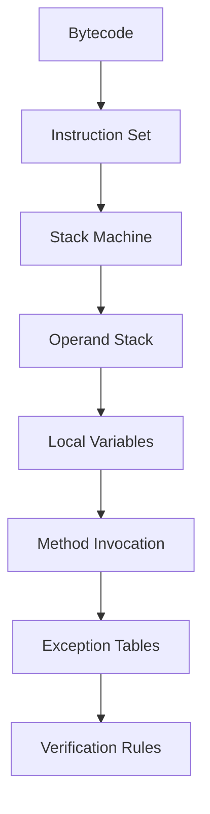

### Mini Project — Predict Bytecode

**Goal**

Predict bytecode before running `javap`.

**Expected Learning**

**Difficulty**

**Estimated Time**

### Knowledge Card — Bytecode

| Item | Details |
| --- | --- |
| Parent | Java Platform |
| Purpose |  |
| Components | Instruction Set; Stack Machine; Operand Stack; Local Variables; Method Invocation; Exception Tables; Verification Rules |
| Dependencies | [Class File](#phase-4--class-file) |
| Consumers | [JVM](#phase-6--jvm) |
| Lifecycle |  |
| Algorithms |  |
| Common Mistakes |  |
| Mini Project | Predict bytecode before running `javap`. |
| OpenJDK Source |  |

See also:

- [Class File](#phase-4--class-file)
- [JVM](#phase-6--jvm)

### Completion Checklist

- [ ] I understand why this subsystem exists
- [ ] I understand every component
- [ ] I understand interactions
- [ ] I know dependencies
- [ ] I can explain it without notes
- [ ] I built the suggested mini project

---

## Phase 6 — JVM

Now open the biggest assembly.

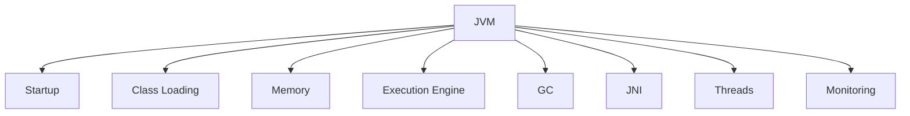

> **Note**
>
> This alone may take several weeks.

### Knowledge Card — JVM

| Item | Details |
| --- | --- |
| Parent | Java Platform |
| Purpose |  |
| Components | Startup; Class Loading; Memory; Execution Engine; GC; JNI; Threads; Monitoring |
| Dependencies | [Bytecode](#phase-5--bytecode); [Class File](#phase-4--class-file) |
| Consumers | Runtime Libraries; Concurrency; Diagnostics |
| Lifecycle |  |
| Algorithms |  |
| Common Mistakes |  |
| Mini Project |  |
| OpenJDK Source |  |

### Assembly 6.1 — Class Loading

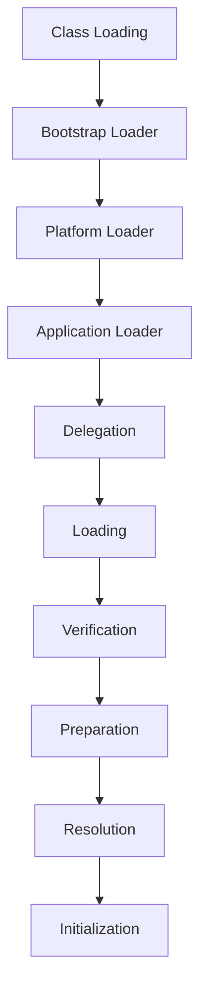

#### Mini Project — Write Your Own ClassLoader

**Goal**

Write your own `ClassLoader`.

**Expected Learning**

**Difficulty**

**Estimated Time**

#### Knowledge Card — Class Loading

| Item | Details |
| --- | --- |
| Parent | JVM |
| Purpose |  |
| Components | Bootstrap Loader; Platform Loader; Application Loader; Delegation; Loading; Verification; Preparation; Resolution; Initialization |
| Dependencies | [Class File](#phase-4--class-file); [Bytecode](#phase-5--bytecode) |
| Consumers | JVM runtime |
| Lifecycle | Loading; Verification; Preparation; Resolution; Initialization |
| Algorithms | Delegation |
| Common Mistakes |  |
| Mini Project | Write your own ClassLoader. |
| OpenJDK Source |  |

See also:

- [Class File](#phase-4--class-file)
- [Bytecode](#phase-5--bytecode)
- [OpenJDK Source Code](#phase-13--openjdk-source-code)

### Assembly 6.2 — Runtime Memory

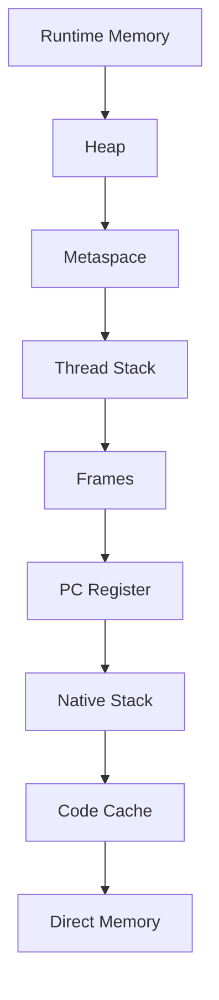

Every memory region should answer:

| Question | Details |
| --- | --- |
| Owner |  |
| Purpose |  |
| Lifetime |  |
| Contents |  |
| Creation |  |
| Destruction |  |

#### Knowledge Card — Runtime Memory

| Item | Details |
| --- | --- |
| Parent | JVM |
| Purpose |  |
| Components | Heap; Metaspace; Thread Stack; Frames; PC Register; Native Stack; Code Cache; Direct Memory |
| Dependencies | [Class Loading](#assembly-61--class-loading) |
| Consumers | Objects; Execution Engine; GC; Threads |
| Lifecycle | Owner; Purpose; Lifetime; Contents; Creation; Destruction |
| Algorithms |  |
| Common Mistakes |  |
| Mini Project |  |
| OpenJDK Source |  |

See also:

- [Objects](#assembly-63--objects)
- [Garbage Collection](#assembly-65--garbage-collection)

### Assembly 6.3 — Objects

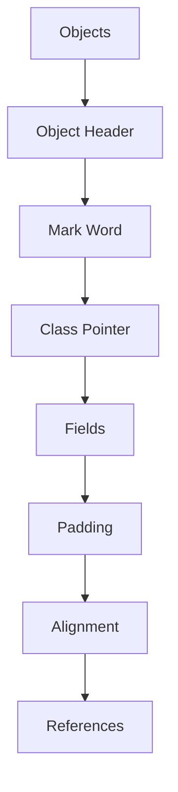

#### Mini Project — Measure Objects with JOL

**Goal**

Measure objects using JOL (Java Object Layout).

**Expected Learning**

**Difficulty**

**Estimated Time**

#### Knowledge Card — Objects

| Item | Details |
| --- | --- |
| Parent | JVM |
| Purpose |  |
| Components | Object Header; Mark Word; Class Pointer; Fields; Padding; Alignment; References |
| Dependencies | [Runtime Memory](#assembly-62--runtime-memory) |
| Consumers | Garbage Collection; application code |
| Lifecycle |  |
| Algorithms |  |
| Common Mistakes |  |
| Mini Project | Measure objects using JOL (Java Object Layout). |
| OpenJDK Source |  |

See also:

- [Runtime Memory](#assembly-62--runtime-memory)
- [Garbage Collection](#assembly-65--garbage-collection)

### Assembly 6.4 — Execution Engine

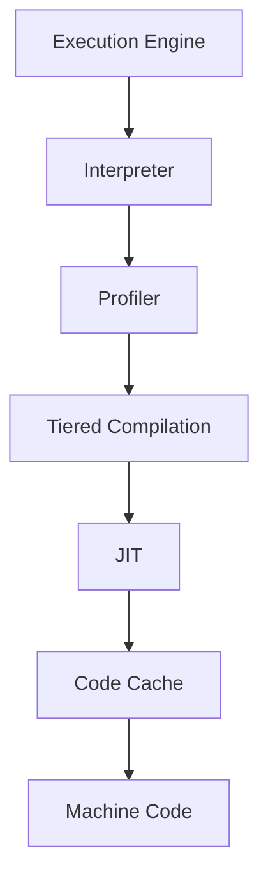

Study each optimization separately.

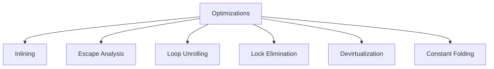

#### Mini Project — Observe Optimization Effects

**Goal**

Use JMH to observe optimization effects.

**Expected Learning**

**Difficulty**

**Estimated Time**

#### Knowledge Card — Execution Engine

| Item | Details |
| --- | --- |
| Parent | JVM |
| Purpose |  |
| Components | Interpreter; Profiler; Tiered Compilation; JIT; Code Cache; Machine Code |
| Dependencies | [Bytecode](#phase-5--bytecode); [Runtime Memory](#assembly-62--runtime-memory) |
| Consumers | Program execution |
| Lifecycle |  |
| Algorithms | Inlining; Escape Analysis; Loop Unrolling; Lock Elimination; Devirtualization; Constant Folding |
| Common Mistakes |  |
| Mini Project | Use JMH to observe optimization effects. |
| OpenJDK Source |  |

See also:

- [Bytecode](#phase-5--bytecode)
- [Runtime Memory](#assembly-62--runtime-memory)
- [OpenJDK Source Code](#phase-13--openjdk-source-code)

### Assembly 6.5 — Garbage Collection

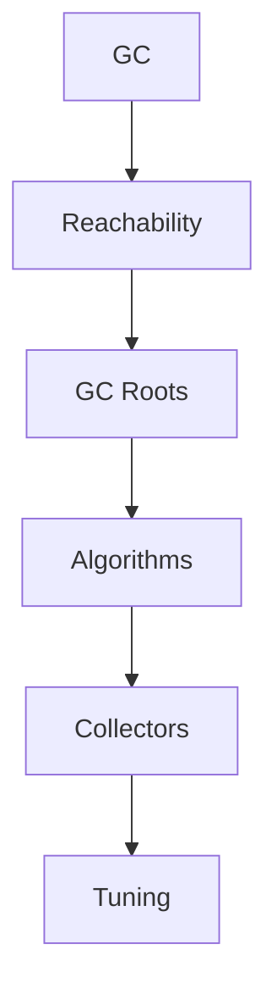

#### Algorithms

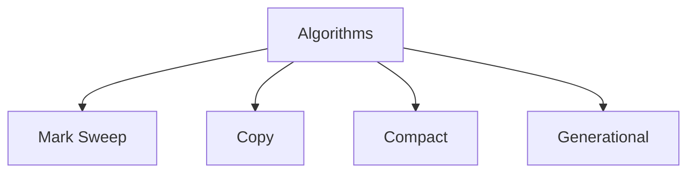

#### Collectors

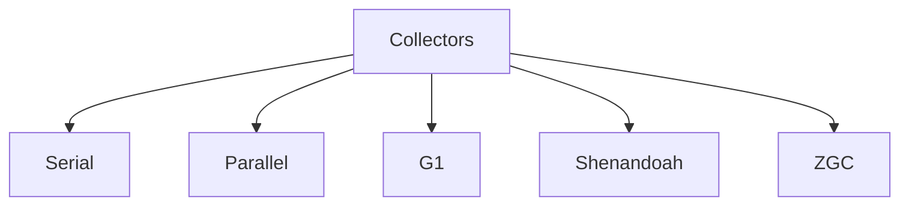

#### Mini Project — Implement a Toy Mark-and-Sweep Collector

**Goal**

Implement a toy mark-and-sweep collector.

**Expected Learning**

**Difficulty**

**Estimated Time**

#### Knowledge Card — Garbage Collection

| Item | Details |
| --- | --- |
| Parent | JVM |
| Purpose |  |
| Components | Reachability; GC Roots; Algorithms; Collectors; Tuning |
| Dependencies | [Runtime Memory](#assembly-62--runtime-memory); [Objects](#assembly-63--objects) |
| Consumers | JVM runtime |
| Lifecycle |  |
| Algorithms | Mark Sweep; Copy; Compact; Generational |
| Common Mistakes |  |
| Mini Project | Implement a toy mark-and-sweep collector. |
| OpenJDK Source |  |

See also:

- [Runtime Memory](#assembly-62--runtime-memory)
- [Objects](#assembly-63--objects)
- [Diagnostics](#phase-12--diagnostics)

### Completion Checklist

- [ ] I understand why this subsystem exists
- [ ] I understand every component
- [ ] I understand interactions
- [ ] I know dependencies
- [ ] I can explain it without notes
- [ ] I built the suggested mini project

---

## Phase 7 — Runtime Libraries

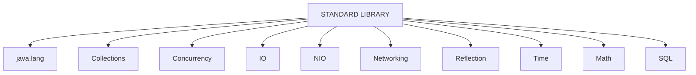

Each package becomes its own reverse engineering project.

### Knowledge Card — Runtime Libraries

| Item | Details |
| --- | --- |
| Parent | Java Platform |
| Purpose |  |
| Components | java.lang; Collections; Concurrency; IO; NIO; Networking; Reflection; Time; Math; SQL |
| Dependencies | [JVM](#phase-6--jvm) |
| Consumers | Java applications |
| Lifecycle |  |
| Algorithms |  |
| Common Mistakes |  |
| Mini Project |  |
| OpenJDK Source |  |

### Collections

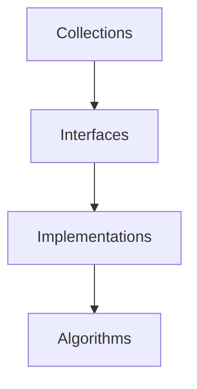

#### Map

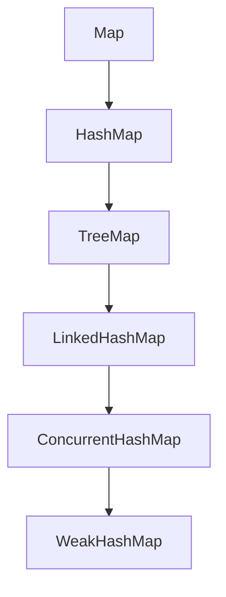

#### HashMap

```mermaid
flowchart TD
    HashMap --> Buckets --> Hashing --> Collisions --> Resize --> Treeification --> Iteration
```

#### Mini Project — Build HashMap Yourself

**Goal**

Build `HashMap` yourself.

**Expected Learning**

**Difficulty**

**Estimated Time**

#### Knowledge Card — Collections

| Item | Details |
| --- | --- |
| Parent | Runtime Libraries |
| Purpose |  |
| Components | Interfaces; Implementations; Algorithms |
| Dependencies | [JVM](#phase-6--jvm) |
| Consumers | Java applications; Runtime Libraries |
| Lifecycle |  |
| Algorithms |  |
| Common Mistakes |  |
| Mini Project | Build HashMap yourself. |
| OpenJDK Source |  |

#### Knowledge Card — HashMap

| Item | Details |
| --- | --- |
| Parent | HashMap → Collections → Runtime Libraries |
| Purpose |  |
| Components | Buckets; Hashing; Collisions; Resize; Treeification; Iteration |
| Dependencies | Collections interfaces |
| Consumers | Java applications |
| Lifecycle |  |
| Algorithms | Hashing; collision handling; resize; treeification |
| Common Mistakes |  |
| Mini Project | Build HashMap yourself. |
| OpenJDK Source |  |

See also:

- [Concurrency](#phase-8--concurrency)
- [OpenJDK Source Code](#phase-13--openjdk-source-code)

### Completion Checklist

- [ ] I understand why this subsystem exists
- [ ] I understand every component
- [ ] I understand interactions
- [ ] I know dependencies
- [ ] I can explain it without notes
- [ ] I built the suggested mini project

---

## Phase 8 — Concurrency

Treat this as another system.

```mermaid
flowchart TD
    Concurrency --> Threads --> MemoryModel[Memory Model] --> Synchronization --> Locks --> Executors --> ForkJoin --> Atomics --> VirtualThreads[Virtual Threads]
```

### Locks

```mermaid
flowchart TD
    Locks --> Synchronized[synchronized] --> Monitor --> ReentrantLock --> ReadWriteLock --> StampedLock --> AQS
```

### Mini Project — Build a Thread Pool

**Goal**

Build a thread pool.

**Expected Learning**

**Difficulty**

**Estimated Time**

### Knowledge Card — Concurrency

| Item | Details |
| --- | --- |
| Parent | Java Platform; Runtime Libraries |
| Purpose |  |
| Components | Threads; Memory Model; Synchronization; Locks; Executors; ForkJoin; Atomics; Virtual Threads |
| Dependencies | [JVM](#phase-6--jvm); [Runtime Memory](#assembly-62--runtime-memory) |
| Consumers | Java applications; Runtime Libraries |
| Lifecycle |  |
| Algorithms |  |
| Common Mistakes |  |
| Mini Project | Build a thread pool. |
| OpenJDK Source |  |

See also:

- [Runtime Memory](#assembly-62--runtime-memory)
- [Collections](#collections)
- [Diagnostics](#phase-12--diagnostics)

### Completion Checklist

- [ ] I understand why this subsystem exists
- [ ] I understand every component
- [ ] I understand interactions
- [ ] I know dependencies
- [ ] I can explain it without notes
- [ ] I built the suggested mini project

---

## Phase 9 — IO

```mermaid
flowchart TD
    IO --> Streams --> Readers --> Writers --> Files --> Serialization --> NIO --> Channels --> Buffers --> Selectors
```

### Mini Project — Write a File Server Using NIO

**Goal**

Write a file server using NIO.

**Expected Learning**

**Difficulty**

**Estimated Time**

### Knowledge Card — IO

| Item | Details |
| --- | --- |
| Parent | Runtime Libraries |
| Purpose |  |
| Components | Streams; Readers; Writers; Files; Serialization; NIO; Channels; Buffers; Selectors |
| Dependencies | [Runtime Libraries](#phase-7--runtime-libraries) |
| Consumers | Java applications; Networking |
| Lifecycle |  |
| Algorithms |  |
| Common Mistakes |  |
| Mini Project | Write a file server using NIO. |
| OpenJDK Source |  |

See also:

- [Networking](#phase-10--networking)
- [Runtime Libraries](#phase-7--runtime-libraries)

### Completion Checklist

- [ ] I understand why this subsystem exists
- [ ] I understand every component
- [ ] I understand interactions
- [ ] I know dependencies
- [ ] I can explain it without notes
- [ ] I built the suggested mini project

---

## Phase 10 — Networking

```mermaid
flowchart TD
    Networking --> Socket --> ServerSocket --> HTTPClient[HTTP Client] --> SSL --> URI --> URL
```

### Mini Project — Implement a Tiny HTTP Server

**Goal**

Implement a tiny HTTP server.

**Expected Learning**

**Difficulty**

**Estimated Time**

### Knowledge Card — Networking

| Item | Details |
| --- | --- |
| Parent | Runtime Libraries |
| Purpose |  |
| Components | Socket; ServerSocket; HTTP Client; SSL; URI; URL |
| Dependencies | [IO](#phase-9--io) |
| Consumers | Java applications |
| Lifecycle |  |
| Algorithms |  |
| Common Mistakes |  |
| Mini Project | Implement a tiny HTTP server. |
| OpenJDK Source |  |

See also:

- [IO](#phase-9--io)
- [Runtime Libraries](#phase-7--runtime-libraries)

### Completion Checklist

- [ ] I understand why this subsystem exists
- [ ] I understand every component
- [ ] I understand interactions
- [ ] I know dependencies
- [ ] I can explain it without notes
- [ ] I built the suggested mini project

---

## Phase 11 — Reflection

```mermaid
flowchart TD
    Reflection --> Class --> Method --> Field --> Constructor --> Annotation --> DynamicProxy[Dynamic Proxy] --> MethodHandles[Method Handles] --> VarHandles
```

### Mini Project — Create a Mini Dependency Injection Container

**Goal**

Create a mini dependency injection container.

**Expected Learning**

**Difficulty**

**Estimated Time**

### Knowledge Card — Reflection

| Item | Details |
| --- | --- |
| Parent | Runtime Libraries |
| Purpose |  |
| Components | Class; Method; Field; Constructor; Annotation; Dynamic Proxy; Method Handles; VarHandles |
| Dependencies | [Java Language](#phase-2--java-language); [JVM](#phase-6--jvm) |
| Consumers | Frameworks; Java applications |
| Lifecycle |  |
| Algorithms |  |
| Common Mistakes |  |
| Mini Project | Create a mini dependency injection container. |
| OpenJDK Source |  |

See also:

- [Java Language](#phase-2--java-language)
- [JVM](#phase-6--jvm)

### Completion Checklist

- [ ] I understand why this subsystem exists
- [ ] I understand every component
- [ ] I understand interactions
- [ ] I know dependencies
- [ ] I can explain it without notes
- [ ] I built the suggested mini project

---

## Phase 12 — Diagnostics

```mermaid
flowchart TD
    Diagnostics --> ThreadDump[Thread Dump] --> HeapDump[Heap Dump] --> GCLogs[GC Logs] --> JFR --> JMC --> jcmd --> jmap --> jstack
```

### Mini Project — Diagnose Intentionally Broken Applications

**Goal**

Diagnose intentionally broken applications:

- Deadlock
- Memory leak
- CPU spike
- Excessive GC
- Thread starvation

**Expected Learning**

**Difficulty**

**Estimated Time**

### Knowledge Card — Diagnostics

| Item | Details |
| --- | --- |
| Parent | Java Platform |
| Purpose |  |
| Components | Thread Dump; Heap Dump; GC Logs; JFR; JMC; jcmd; jmap; jstack |
| Dependencies | [JVM](#phase-6--jvm); [Concurrency](#phase-8--concurrency); [Garbage Collection](#assembly-65--garbage-collection) |
| Consumers | Engineers diagnosing applications |
| Lifecycle |  |
| Algorithms |  |
| Common Mistakes |  |
| Mini Project | Diagnose deadlock, memory leak, CPU spike, excessive GC, and thread starvation. |
| OpenJDK Source |  |

See also:

- [Concurrency](#phase-8--concurrency)
- [Garbage Collection](#assembly-65--garbage-collection)

### Completion Checklist

- [ ] I understand why this subsystem exists
- [ ] I understand every component
- [ ] I understand interactions
- [ ] I know dependencies
- [ ] I can explain it without notes
- [ ] I built the suggested mini project

---

## Phase 13 — OpenJDK Source Code

Read in this exact order:

```mermaid
flowchart TD
    Object --> Class --> String --> Thread --> ClassLoader --> ArrayList --> HashMap --> ConcurrentHashMap --> CompletableFuture --> ForkJoinPool
```

Then:

```mermaid
flowchart TD
    Runtime[hotspot/runtime] --> Interpreter[hotspot/interpreter] --> Compiler[hotspot/compiler] --> GC[hotspot/gc] --> Memory[hotspot/memory] --> Classfile[hotspot/classfile]
```

### Knowledge Card — OpenJDK Source Code

| Item | Details |
| --- | --- |
| Parent | Java Platform |
| Purpose |  |
| Components | Object; Class; String; Thread; ClassLoader; ArrayList; HashMap; ConcurrentHashMap; CompletableFuture; ForkJoinPool; hotspot/runtime; hotspot/interpreter; hotspot/compiler; hotspot/gc; hotspot/memory; hotspot/classfile |
| Dependencies | All preceding phases |
| Consumers | Study of Java Platform implementation |
| Lifecycle |  |
| Algorithms |  |
| Common Mistakes | Reading in a different order than specified. |
| Mini Project |  |
| OpenJDK Source | Object; Class; String; Thread; ClassLoader; ArrayList; HashMap; ConcurrentHashMap; CompletableFuture; ForkJoinPool; `hotspot/runtime`; `hotspot/interpreter`; `hotspot/compiler`; `hotspot/gc`; `hotspot/memory`; `hotspot/classfile` |

See also:

- [Class Loading](#assembly-61--class-loading)
- [Execution Engine](#assembly-64--execution-engine)
- [Garbage Collection](#assembly-65--garbage-collection)

### Completion Checklist

- [ ] I understand why this subsystem exists
- [ ] I understand every component
- [ ] I understand interactions
- [ ] I know dependencies
- [ ] I can explain it without notes
- [ ] I built the suggested mini project

---

## Phase 14 — Reassemble the Entire System

This is your “everything works together” phase.

Trace one Java program from source to exit:

```mermaid
flowchart TD
    JavaSource[Java Source] --> Compiler --> ClassFile[Class File] --> ClassLoader[Class Loader] --> Verification --> RuntimeMemory[Runtime Memory] --> Interpreter --> JITCompilation[JIT Compilation] --> MachineCode[Machine Code] --> ObjectsAllocated[Objects Allocated] --> ThreadsExecute[Threads Execute] --> GarbageCollection[Garbage Collection] --> ProgramExit[Program Exit]
```

At this point, every arrow in that pipeline should correspond to a subsystem you've already taken apart and understood.

### Knowledge Card — Reassembled System

| Item | Details |
| --- | --- |
| Parent | Java Platform |
| Purpose | Everything works together. |
| Components | Java Source; Compiler; Class File; Class Loader; Verification; Runtime Memory; Interpreter; JIT Compilation; Machine Code; Objects Allocated; Threads Execute; Garbage Collection; Program Exit |
| Dependencies | All preceding phases |
| Consumers | A complete Java program |
| Lifecycle | Java Source → Compiler → Class File → Class Loader → Verification → Runtime Memory → Interpreter → JIT Compilation → Machine Code → Objects Allocated → Threads Execute → Garbage Collection → Program Exit |
| Algorithms |  |
| Common Mistakes |  |
| Mini Project |  |
| OpenJDK Source |  |

See also:

- [Compiler](#phase-3--compiler)
- [Class File](#phase-4--class-file)
- [Class Loading](#assembly-61--class-loading)
- [Runtime Memory](#assembly-62--runtime-memory)
- [Execution Engine](#assembly-64--execution-engine)
- [Garbage Collection](#assembly-65--garbage-collection)

### Completion Checklist

- [ ] I understand why this subsystem exists
- [ ] I understand every component
- [ ] I understand interactions
- [ ] I know dependencies
- [ ] I can explain it without notes
- [ ] I built the suggested mini project

---

## Knowledge Cards

One addition I would make: a **Knowledge Card** for every topic.

This is the part I think will make your learning unusually effective.

For **every node** in the tree—whether it's `HashMap`, `ClassLoader`, `JIT`, or `G1 GC`—create a one-page knowledge card with the same template:

| Section | What to capture |
| --- | --- |
| **Parent** | Where does this live? (e.g., `HashMap` → Collections → Runtime Libraries) |
| **Purpose** | Why does it exist? |
| **Children** | What components make it up? |
| **Dependencies** | What must exist before this can work? |
| **Consumers** | What uses this component? |
| **Lifecycle** | How is it created, used, and destroyed? |
| **Algorithms** | Which algorithms or design patterns does it rely on? |
| **Common misconceptions** | What do developers often get wrong? |
| **Hands-on proof** | A small experiment or mini-project to validate your understanding. |
| **Source code** | Where is it implemented in OpenJDK? |

### Reusable Knowledge Card Template

| Item | Details |
| --- | --- |
| Parent |  |
| Purpose |  |
| Components |  |
| Dependencies |  |
| Consumers |  |
| Lifecycle |  |
| Algorithms |  |
| Common Mistakes |  |
| Mini Project |  |
| OpenJDK Source |  |

For example, when you finish studying `HashMap`, you shouldn't just say “I know HashMap.” You should be able to fill in every section of that card from memory. Repeat that process for every major node, and by the end you'll have a consistent, interconnected map of the entire Java platform rather than a collection of isolated facts.

I think this approach is much closer to how an experienced engineer builds expertise: not by accumulating topics, but by constructing a mental architecture where every concept has a precise place and a clear relationship to the rest of the system.
